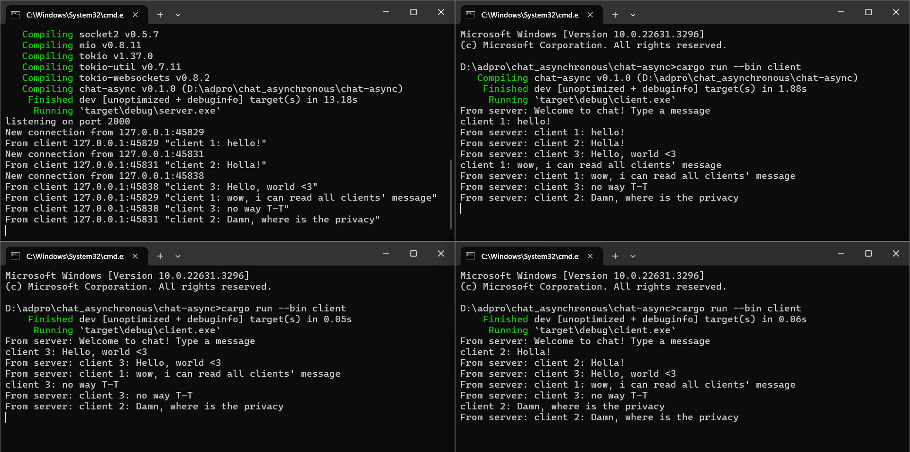
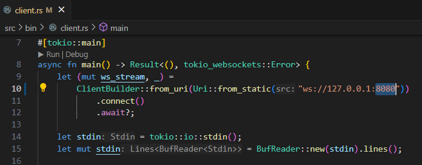
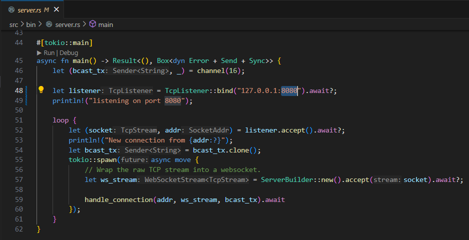
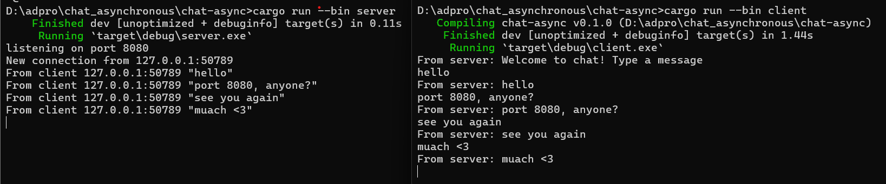
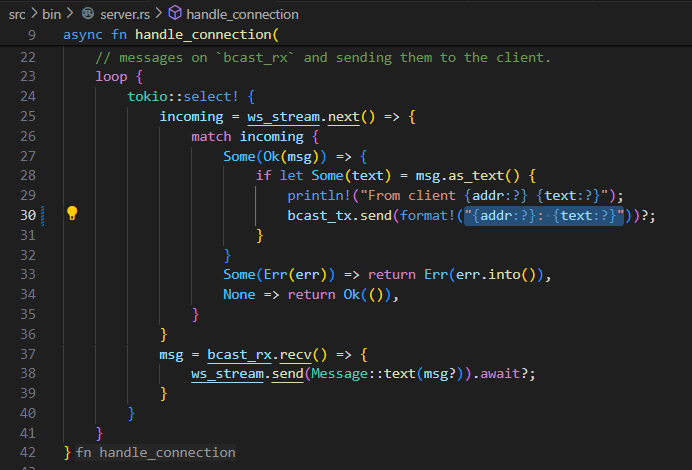
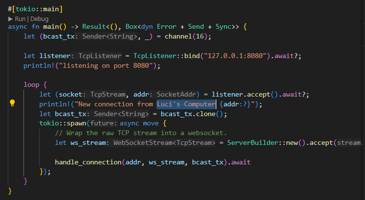
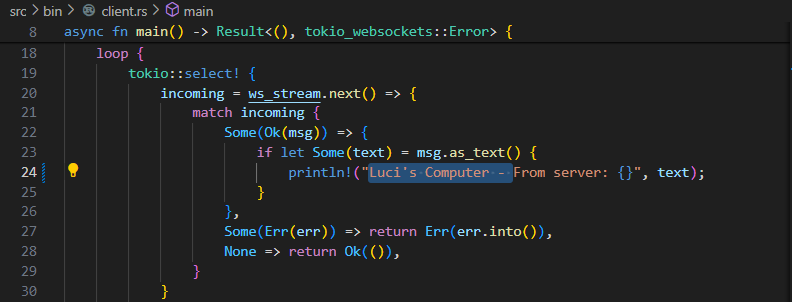
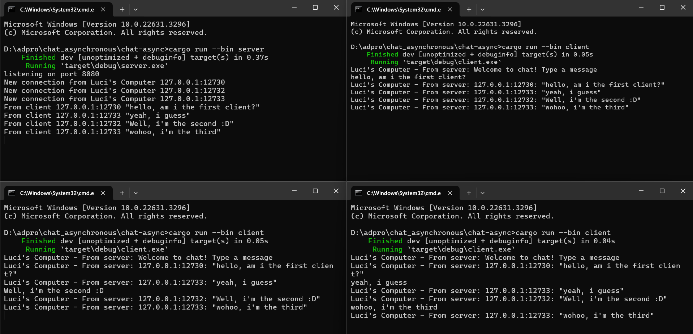

## Tutorial 2: Broadcast Chat
### 2.1. Original code of broadcast chat

#### How to run it, and what happens when you type some text in the clients ?
Untuk menjalankan satu server dan tiga clients, pertama-tama kita harus menjalankan servernya terlebih dahulu agar dapat menerima pesan dari client. Buka terminal di path tempat project `chat-async` berada kemudian jalankan perintah `cargo run --bin server`. Buka 3 buah tab atau jendela terminal baru di path yang sama. Untuk setiap tab atau terminal baru tersebut, jalankan perintah `cargo run --bin client`. Setelah semua client terhubung, kita bisa amati bahwa pesan yang kita kirimkan (dengan ketik pesan dan klik enter) akan dikirim ke server (terlihat di sisi server). Server juga akan menyebarkan (mengirim) pesan tersebut kepada semua client yang sedang terhubung ke server. Dengan begitu, semua client yang sedang terhubung bisa menerima (melihat) semua pesan yang dikirim oleh client lain ke server, juga menerima kembali pesan yang ia kirim ke server. 
### 2.2. Modifying the websocket port
#### Apa yang dimodifikasi?
1. Di sisi client

Memastikan client terhubung ke URI port 8080 -> `ClientBuilder::from_uri(Uri::from_static("ws://127.0.0.1:8080"))...` 
 

2. Di sisi server 

* Mengubah port yang di-_binding_ -> `let listener = TcpListener::bind("127.0.0.1:8080").await?;`

* Mengganti pesan yang tercetak -> `println!("listening on port 8080");`
#### Make sure it still runs properly [√]

Program masih dapat berjalan dengan baik setelah portnya diganti. Kedua file, `server.rs` dan `client.rs`, masih menggunakan protokol WebSocket yang sama. Protokol tersebut didefinisikan melalui penggunaan modul `tokio_websockets`. Dengan mengubah port menjadi 8080, aplikasi akan dikonfigurasi agar menggunakan port tersebut untuk komunikasi WebSocket.

### 2.3. Small changes. Add some information to client
#### Send information about the IP and Port of the sender
1. Perubahan di sisi server
 
* Menambahkan alamat(IP dan Port) pengirim pesan ke setiap pesan yang disebarkan (diteruskan) oleh server
 

* Menambahkan keterangan asal komputer saat menampilkan pesan adanya koneksi baru ke server
 

 

2. Perubahan di sisi client
 
Menambahkan nama komputer ke dalam pesan yang diterima dari server
 

 
Hasilnya tampak seperti di bawah 
 

 
Di sisi server, keterangan adanya koneksi baru sekarang disertai nama asal komputer ("New connection from _Luci's Computer_ [alamat]"). Sedangkan di sisi client, pesan yang diterima dari server sekarang memiliki nama komputer(Luci's Computer) beserta IP (127.0.0.1) dan Port milik client yang mengirim pesan ke server.
